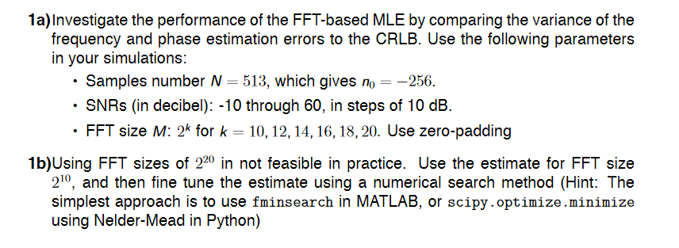
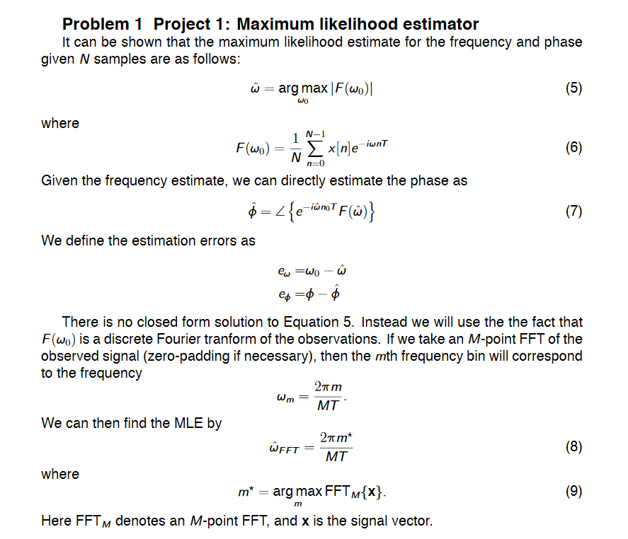

# monkey_estimation
Code for the Estimation (1) project in TTT4275

## How to run
This repo contains two driver scripts:
#### main.py
* Generates csv files with data for both parts of the project
* Callable using `./main.py <arg>` from the root folder where \<arg> is either **a** or **b**, depending on which part of the project you wish to run
* Amount of samples for each run needs to be specified in the code itself, by changing "N". Note that the choice of this value
HEAVILY affects execution time.

#### scripts/plot.py
* Generates csv files with data for both parts of the project
* Callable using `./scripts/plot.py <filename>` from the root folder where \<fileame> is the name of the .csv file in /data that you wish to plot. Note the VERY specific formatting of these data files; they should only really be generated using main.py

## The motivation

## The tasks

## The theory

